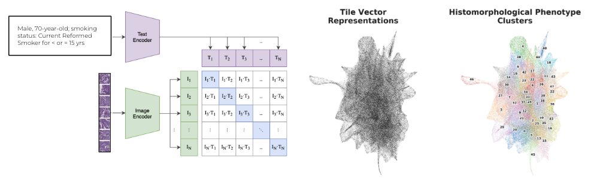

# HPL-Modified

Modifications to the [Histomorphological Phenotype Learning pipeline](https://github.com/AdalbertoCq/Histomorphological-Phenotype-Learning).

Original HPL paper by Quiros et al. is here: https://www.nature.com/articles/s41467-024-48666-7.

## Authors
Yumi Briones - yb2612@nyu.edu, Yumi.Briones@nyulangone.org  
Jennifer Motter - mottej02@nyu.edu, Jennifer.Motter@nyulangone.org  
Alyssa Pradhan - amp10295@nyu.edu, Alyssa.Pradhan@nyulangone.org  

## Repo structure
* `docs` - documentation
* `scripts` - scripts for automation (e.g., python scripts, bash scripts to run batch jobs on HPC)
* `notebooks` - Jupyter notebooks

## Data

All data is from https://github.com/AdalbertoCq/Histomorphological-Phenotype-Learning.

1. For initial training, we used a 250k subsample of LUAD and LUSC samples: [LUAD & LUSC 250K subsample](https://drive.google.com/drive/folders/1FuPkMnv6CiDe26doUXfEfQEWShgbmp9P)
2. For complete train, validation, and test sets, we used: [LUAD & LUSC datasets](https://drive.google.com/drive/folders/18skVh8Vk6zoxG3Se5Vlb7a3EKP2xHXXd)
3. To get original HPL tile embeddings, we used: [LUAD & LUSC tile vector representations](https://drive.google.com/file/d/1KEHA0-AhxQsP_lQE06Jc5S8rzBkfKllV/view?usp=sharing)
4. To get the original HPL-HPC assignments, we used: [LUAD vs LUSC type classification and HPC assignments](https://drive.google.com/drive/folders/1TcwIJuSNGl4GC-rT3jh_5cqML7hGR0Ht)

## Modifications

### HPL-CLIP
*Point person: Yumi Briones*

Original CLIP paper: https://arxiv.org/pdf/2103.00020

Tutorial: https://github.com/yumibriones/HPL-Modified/blob/main/docs/HPL-CLIP_tutorial.md

To enable multimodal learning, we integrated Contrastive Language-Image Pre-Training (CLIP) by OpenAI ([open_clip implementation](https://github.com/mlfoundations/open_clip)) into the HPL pipeline.

Briefly, we first generated text captions for each image incorporating information on age, gender, and smoking status. We then trained a CLIP model on these image-text pairs using the ViT-B-32 architecture. Finally, we generated HPCs from the image embeddings generated by CLIP following the HPL pipeline (i.e., Leiden clustering).

#### HPL-CONCH

As a bonus, we generated image embeddings from CONtrastive learning from Captions for Histopathology (CONCH) by the Mahmood Lab (https://github.com/mahmoodlab/CONCH). This is a CLIP-style model that has been trained on over a million histopathology image-caption pairs. A caveat is that pathological information is included in the captions, so clusters generated from this method will be somewhat supervised.

### HPL-VICReg
*Point person: Jennifer Motter*

Original VICReg paper: https://arxiv.org/pdf/2105.04906

We changed the self-supervised learning (SSL) method of HPL from Barlow Twins to Variance-Invariance-Covariance Regularization (VICReg).

### HPL-ViT
*Point person: Alyssa Pradhan*

Original ViT paper: https://arxiv.org/pdf/2010.11929

We replaced the convolutional neural network (CNN) backbone of HPL to a vision transformer (ViT).

## Results

We redid UMAP and Leiden clustering on the original HPL embeddings. We also did the same analysis for all modifications of HPL (i.e., HPL-CLIP, HPL-CONCH, HPL-VICReg, HPL-ViT). All results can be found here: [HPL-Modified Results](https://drive.google.com/drive/folders/11N90nfzHcVXhI4aQpWc3PjFSY3ryGdMr?usp=sharing).

Briefly, this is how results were generated:

1. Extract embeddings from the original HPL pipeline using [notebooks/extract_embeddings_hpl.ipynb](https://github.com/yumibriones/HPL-Modified/blob/main/notebooks/extract_embeddings_hpl.ipynb).
2. Extract embeddings from HPL-CLIP using [scripts/py/extract_embeddings_clip.py](https://github.com/yumibriones/HPL-Modified/blob/main/scripts/py/extract_embeddings_clip.py).*
3. Extract embeddings from HPL-CONCH using [scripts/py/extract_embeddings_conch.py](https://github.com/yumibriones/HPL-Modified/blob/main/scripts/py/extract_embeddings_conch.py).*
4. Run UMAP/Leiden clustering on embeddings using [scripts/run_umap_leiden.py](https://github.com/yumibriones/HPL-Modified/blob/main/scripts/py/run_umap_leiden.py).*
5. Plot UMAP with clustering results/clinical features overlaid on top using [scripts/plot_umap.py](https://github.com/yumibriones/HPL-Modified/blob/main/scripts/py/plot_umap.py).*

*If submitting as a batch job on HPC, use corresponding scripts in [scripts/bash](https://github.com/yumibriones/HPL-Modified/tree/main/scripts/bash). 

